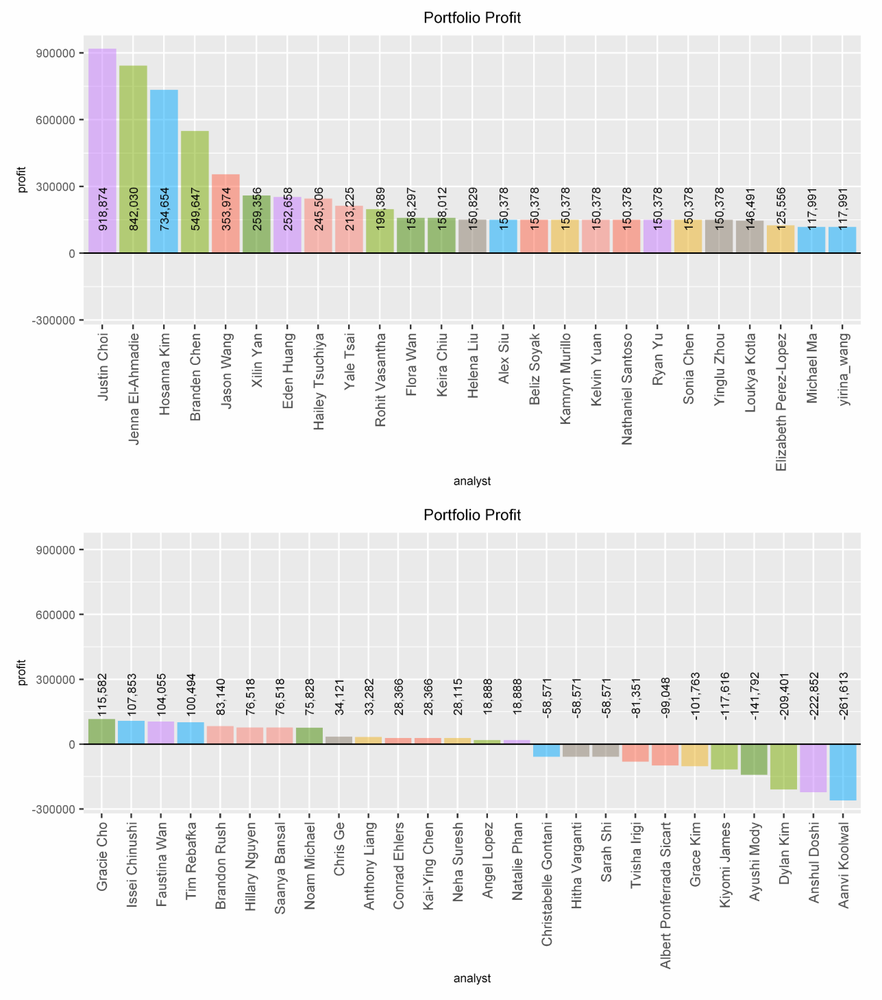

# Stock Portfolio Prediction Case Study

An end-to-end machine learning pipeline in **R** that predicts 12-month stock returns from company financial fundamentals and builds an optimized **$1,000,000**, 12-stock portfolio.

**Result:** +25.3% return · **$252,658 profit** · 7th of ~50 analysts (UGBA 142, UC Berkeley).

**[→ View the full case study](https://edenmhuang.github.io/stock-portfolio-case-study/)**

---

### Results

Ranked **7th of ~50 analysts** in the class-wide investment competition, with a realized profit of **$252,658** (a 25.3% return) on the $1,000,000 budget.

*Class-wide portfolio profit. Eden Huang, 7th overall.*

**Realized per-holding breakdown**

| Ticker | Company | Allocation | 12-mo growth | Profit |
|---|---|--:|--:|--:|
| AMSWA | American Software | $500,122 | +40.8% | +$204,220 |
| NTRB | Nutriband | $62,515 | +233.3% | +$145,869 |
| CPRT | Copart | $31,258 | +69.0% | +$21,556 |
| QADA | QAD Inc | $977 | +9.6% | +$93 |
| TGT | Target Corp | $244 | +27.8% | +$68 |
| FDS | FactSet Research | $488 | +10.7% | +$52 |
| IDT | IDT Corp | $1,954 | −3.3% | −$64 |
| CONN | Conn's Inc | $3,907 | −12.9% | −$505 |
| CATO | Cato Corp | $15,629 | −9.3% | −$1,451 |
| SCWX | Secureworks | $7,814 | −26.3% | −$2,052 |
| PLCE | Children's Place | $125,031 | −45.2% | −$56,481 |
| RFIL | R F Industries | $250,061 | −23.5% | −$58,648 |
| | **Total** | **$1,000,000** | | **+$252,658** |

Two high-conviction winners (American Software and Nutriband) more than offset losses on the other large positions, netting a 25.3% return.

---

### Skills demonstrated

R · machine learning (classification, regression, clustering, kNN, naive Bayes) · PCA · feature engineering & imputation · 5-fold cross-validation · hyperparameter tuning · model deployment · portfolio optimization · profit-driven evaluation.
